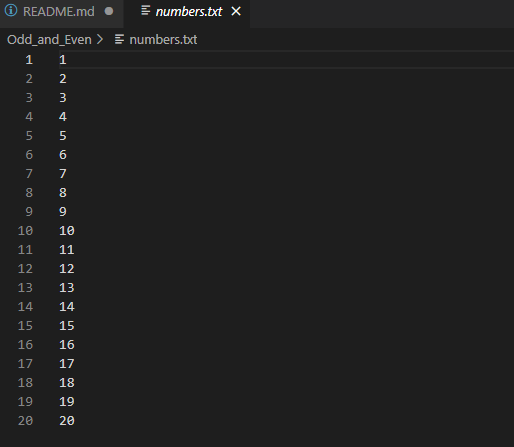
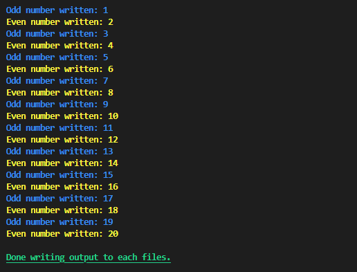
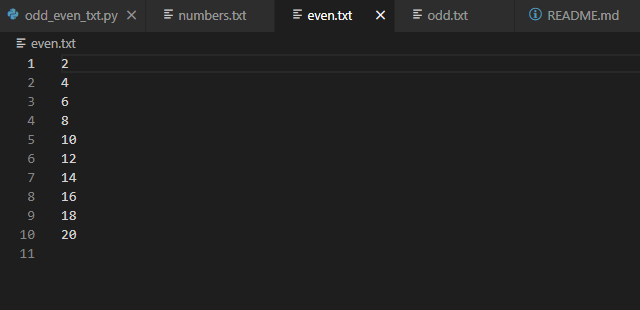
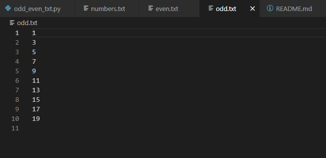

# ODD AND EVEN
### Programming Exercise 1

Write a Python program that reads a text file named numbers.txt that contains 20 integers. The program will create two other text file; the first text file will be named even.txt that will contains all even numbers extracted from the numbers.txt. The second text file will be named odd.txt that will contains all odd numbers extracted from the numbers.txt.

# 20 Integers Contained in numbers.txt

# Example Output

# Example Appended files after running the Program
 
# How To Use / Run
1. Install Python on your computer to run the code. You can download its latest version here: https://www.python.org/downloads/ 
2. Copy the code from the repository. 
3. Open an IDE and paste the code. 
4. Save the file with a .py extension. 
5. Run the code. 
